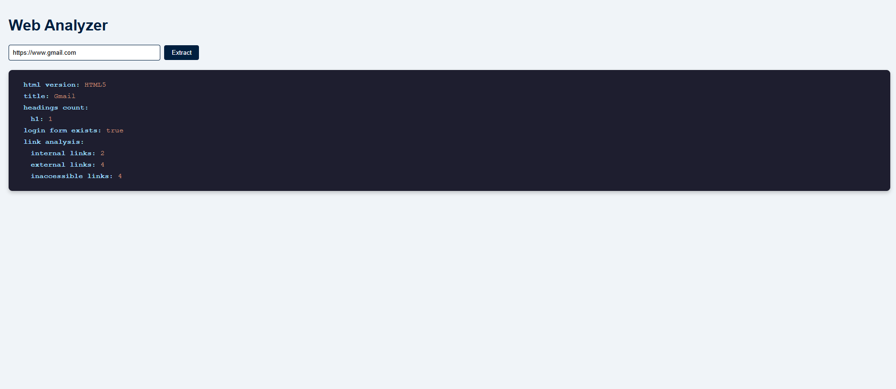

# Web Analyzer Frontend

The front-end application of web-analyzer. Developed using React.js.



This application invokes backend API with a POST call.

Backend project : https://github.com/silentWizardWin/web-analyzer-be
* Start the backend server before using the front-end application

## How to run the front-end locally:

```
npm install
npm start
```

## Build and run using Docker container:

```
docker build -t web-analyzer-fe .
docker run -p 3000:3000 web-analyzer-fe
```